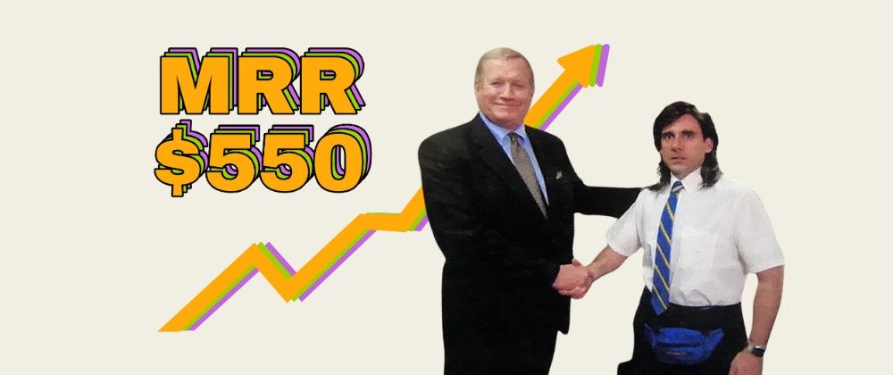

## SaaS Marketing

  

    
  

  

    <h4 style="margin-top:0; margin-bottom: 5px;"><a href="https://docs.opensaas.sh/blog/2025-05-21-saas-cost-marketing-breakdown/">Cost, profit, & marketing breakdown for my Profitable SaaS</a></h4>
    
An overview of my $550 MRR micro SaaS app since launch.

  

## Tutorials & Videos

  

    
  

  

    <h4 style="margin-top:0; margin-bottom: 5px;"><a href="https://youtu.be/WYzEROo7reY?si=c5hkEkNBCMBQvyf5">vibe coding a personal finance app</a></h4>
    
Complete 3hr walkthrough w/ template repo.

  

## Repos, Templates & Example Apps

  

    
  

  

    <h4 style="margin-top:0; margin-bottom: 5px;"><a href="http://OpenSaaS.sh">OpenSaaS.sh</a></h4>
    
Free, open-source, feature-rich, full-stack React + NodeJS template that manages features for you. More than 10k GitHub Stars ⭐️

  

  

    
  

  

    <h4 style="margin-top:0; margin-bottom: 5px;"><a href="http://CoverLetterGPT.xyz">CoverLetterGPT.xyz</a></h4>
    
Open-source cover letter generator & editor app (~$600 MRR).

  

  

    
  

  

    <h4 style="margin-top:0; margin-bottom: 5px;"><a href="https://github.com/vincanger/envelope-budgeting-test">Personal Budgeting App</a></h4>
    
Repo comes w/ a full set of project-specific cursor rules. built w/ Wasp & Shadcn.

  

  

    
  

  

    <h4 style="margin-top:0; margin-bottom: 5px;"><a href="http://blogbannergpt.xyz">Blog Banner GPT</a></h4>
    
Social media image brainstorm engine and generator.

  

